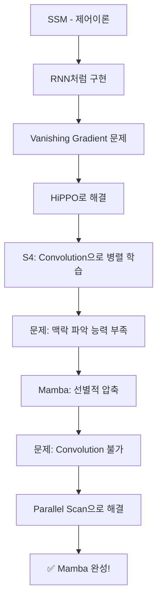

# 🔮 Mamba & State Space Model (SSM) 완벽 정리

> **Mamba**: RNN의 효율성 + Transformer의 성능을 결합한 차세대 시퀀스 모델

---

## 📋 목차
1. [State Space Model (SSM) 기초](#state-space-model-ssm-기초)
2. [SSM의 핵심 방정식](#ssm의-핵심-방정식)
3. [이산화 (Discretization)](#이산화-discretization)
4. [행렬 지수 함수의 의미](#행렬-지수-함수의-의미)
5. [S4 모델](#s4-모델)
6. [Mamba의 혁신](#mamba의-혁신)
7. [Parallel Scan](#parallel-scan)
8. [Mamba vs RNN vs Transformer](#mamba-vs-rnn-vs-transformer)
9. [Mamba 이후의 발전](#mamba-이후의-발전)

---

## 🎯 State Space Model (SSM) 기초

### SSM이란?

> **상태 공간 모델 (State Space Model)**: 시스템의 **상태(state)**를 벡터로 표현하고, 입력에 따른 상태 변화와 출력을 수학적으로 모델링하는 방법

### 직관적 이해

**예시: 2D Grid World**
```
┌─────────────────────┐
│  🤖 ──────→ 🎯      │
│  (현재 위치)  (목표)  │
└─────────────────────┘

상태 벡터 h = [x좌표, y좌표, 목표까지 거리 d, ...]
```

- 현재 좌표 (x, y) = 상태
- 목표까지의 거리 d = 상태의 한 요소
- **상태 벡터**: 시스템을 완전히 설명하는 모든 정보의 집합

### SSM의 핵심 아이디어

```
Input (연속) + State → 다음 State 예측 → Output (연속)
     x(t)        h(t)      h(t+1)           y(t)
```

> 💡 **핵심**: 입력과 현재 상태가 주어졌을 때, 다음 상태와 출력을 예측
> 
> ⚠️ SSM에서 input과 output은 모두 **연속(continuous) 함수**

---

## 📐 SSM의 핵심 방정식

### 1️⃣ State Equation (상태 방정식)

$$h'(t) = A \cdot h(t) + B \cdot x(t)$$

| 기호 | 의미 | 설명 |
|------|------|------|
| $h'(t)$ | 상태의 **변화율** | 현재 상태가 얼마나 빠르게 변하는지 |
| $h(t)$ | 현재 상태 | 시스템의 현재 상태 벡터 |
| $x(t)$ | 입력 | 외부에서 들어오는 신호 |
| $A$ | 시스템 행렬 | 상태가 자체적으로 어떻게 변하는지 (dynamics) |
| $B$ | 입력 행렬 | 입력이 상태에 얼마나 영향을 주는지 |

> 📝 **해석**: 상태의 변화량 = (현재 상태의 자체 변화) + (입력의 영향)

### 2️⃣ Output Equation (출력 방정식)

$$y(t) = C \cdot h(t) + D \cdot x(t)$$

| 기호 | 의미 | 설명 |
|------|------|------|
| $y(t)$ | 출력 | 시스템의 출력 신호 |
| $C$ | 출력 행렬 | 상태를 출력으로 변환 |
| $D$ | 직접 전달 행렬 | 입력이 출력에 직접 영향 (보통 0) |

### 시각적 표현

```
        ┌───────────────────────────────────────┐
        │           State Space Model           │
        │                                       │
x(t) ──►│  ┌─────┐    ┌─────┐    ┌─────┐      │──► y(t)
        │  │  B  │───►│  ∫  │───►│  C  │      │
        │  └─────┘    └──┬──┘    └─────┘      │
        │                │                     │
        │                ▼                     │
        │             h(t)                     │
        │                │                     │
        │          ┌─────┴─────┐               │
        │          │     A     │               │
        │          └───────────┘               │
        └───────────────────────────────────────┘
```

---

## 🔄 이산화 (Discretization)

### 왜 이산화가 필요한가?

> **문제**: SSM은 연속 시간 시스템이지만, 컴퓨터는 이산(discrete) 데이터를 처리
> 
> **해결**: Zero-Order Hold (ZOH) 방식으로 연속 → 이산 변환

### 이산화된 상태 방정식

$$h_k = \bar{A} \cdot h_{k-1} + \bar{B} \cdot x_k$$

$$y_k = C \cdot h_k$$

### ZOH 이산화 공식

| 연속 | 이산 | 변환 공식 |
|------|------|----------|
| $A$ | $\bar{A}$ | $\bar{A} = e^{A \cdot \Delta}$ |
| $B$ | $\bar{B}$ | $\bar{B} = (e^{A \cdot \Delta} - I) \cdot A^{-1} \cdot B$ |

> 여기서 $\Delta$는 시간 간격 (step size)

### 이산화의 의미

```
연속 시간                    이산 시간
───────────                 ───────────
h'(t) = Ah + Bx    →→→     h[k] = Āh[k-1] + B̄x[k]
   (미분방정식)               (점화식/재귀식)
```

---

## 🧮 행렬 지수 함수의 의미

### Q. $e^{A}$가 무엇인가? 행렬을 지수로?

> **답변**: 행렬 지수 함수는 **테일러 급수**를 이용해 정의됩니다.

### 정의

$$e^A = I + A + \frac{A^2}{2!} + \frac{A^3}{3!} + \cdots = \sum_{n=0}^{\infty} \frac{A^n}{n!}$$

| 항 | 의미 |
|---|------|
| $I$ | 항등 행렬 (변화 없음) |
| $A$ | 1차 변화 |
| $A^2/2!$ | 2차 변화 (가속) |
| ... | 고차 변화들 |

### 물리적 의미

> **$e^{A \cdot \Delta}$의 의미**: 변화율 $A$가 주어졌을 때, 시간 $\Delta$ 동안의 **실제 변화량**

```
변화율 A ──[시간 Δ 경과]──► 실제 변화량 e^(AΔ)
```

### 예시: 스칼라의 경우

$$\frac{dx}{dt} = a \cdot x \quad \Rightarrow \quad x(t) = x(0) \cdot e^{at}$$

- $a > 0$: 지수적 증가 (발산)
- $a < 0$: 지수적 감소 (수렴)
- $a = 0$: 변화 없음

---

## 🤔 $\bar{B}$가 복잡한 이유

### Q. 왜 $\bar{B} = (e^{A\Delta} - I) \cdot A^{-1} \cdot B$ 인가?

### 직관적 설명

$$\bar{B} = \left( \int_0^{\Delta} e^{A\tau} d\tau \right) \cdot B$$

1. **$e^{A\tau}$**: 시간 $\tau$ 동안의 시스템 변화
2. **적분 $\int_0^{\Delta}$**: 전체 시간 간격에 걸친 누적 효과
3. **$\cdot B$**: 입력의 영향력 계수

> 📝 **핵심**: $\bar{B}$는 시스템의 dynamics($A$)를 고려하여, 입력 $x$가 상태 업데이트에 **얼마나 반영될지** 결정하는 계수

### 왜 단순히 $B$를 쓰지 않는가?

- 연속 시간에서 입력은 **지속적으로** 들어옴
- 이산화할 때는 한 구간($\Delta$) 동안의 **누적 효과**를 계산해야 함
- 시스템 자체의 변화($A$)가 입력의 효과에도 영향을 줌

---

## ⚡ S4 모델

### S4란?

> **Structured State Space Sequence Model (S4)**
> 
> SSM을 딥러닝으로 성공적으로 구현한 **최초의 모델**

### S4의 핵심 혁신

| 문제 | 해결책 |
|------|--------|
| Vanishing Gradient | **HiPPO** (High-order Polynomial Projection Operator) |
| 학습 속도 | **합성곱(Convolution)** 으로 병렬 처리 |

### HiPPO란?

> 과거 입력을 **다항식으로 근사**하여 압축 저장하는 방법
> 
> → 긴 시퀀스에서도 gradient가 사라지지 않음

### S4에서 합성곱이 가능한 이유

```
조건 1: SSM 방정식이 Linear함
조건 2: A, B, C가 고정됨 (입력과 무관)
         ↓
    합성곱 연산 가능!
         ↓
    병렬 처리로 빠른 학습
```

### Q. SSM 식이 왜 Linear한가?

$$h_k = \bar{A} \cdot h_{k-1} + \bar{B} \cdot x_k$$

- **행렬-벡터 곱셈**만 존재 (비선형 활성화 함수 없음)
- Superposition 원리 적용 가능
- 따라서 **합성곱으로 표현 가능**

### 합성곱 표현

출력을 입력의 합성곱으로 표현:

$$y = K * x$$

여기서 커널 $K$:

$$K = (C\bar{B}, C\bar{A}\bar{B}, C\bar{A}^2\bar{B}, \ldots)$$

> 💡 푸리에 변환을 이용해 합성곱을 **한 번에** 계산

---

## 🐍 Mamba의 혁신

### S4의 한계

| 문제 | 원인 |
|------|------|
| **맥락 파악 능력 부족** | A, B, C가 고정되어 입력에 적응하지 못함 |
| Content-aware 불가 | 모든 입력을 동일하게 처리 |

### Mamba의 해결책: 선별적 압축 (Selective State Space)

> **핵심 아이디어**: A, B, C, $\Delta$를 **입력에 따라 동적으로** 변화시킴

| 파라미터 | S4 | Mamba |
|---------|-----|-------|
| $A$ | 고정 | 고정 (HiPPO 유지) |
| $B$ | 고정 | **입력 의존적** |
| $C$ | 고정 | **입력 의존적** |
| $\Delta$ (step size) | 고정 | **입력 의존적** |

### 선별적 압축의 의미

```
S4:    모든 정보를 동일하게 압축
        ↓
Mamba: 중요한 정보는 많이, 불필요한 정보는 적게 압축
        ↓
       "선별적 압축" (Selective Compression)
```

### 구현 방식

```python
# S4 방식 (고정)
B = parameter  # 학습되지만 입력과 무관

# Mamba 방식 (입력 의존적)
B = Linear(x)  # 입력 x에 따라 B가 결정됨
C = Linear(x)
Δ = softplus(Linear(x))
```

---

## 🔀 Parallel Scan

### 문제: 파라미터가 변하면?

| 모델 | 파라미터 | 합성곱 병렬처리 |
|------|---------|----------------|
| S4 | 고정 | ✅ 가능 |
| Mamba | 입력 의존 | ❌ 불가능 |

> Mamba는 파라미터가 입력마다 바뀌므로 일반 합성곱 불가

### 해결책: Parallel Scan (Blelloch Scan)

#### 기본 아이디어

SSM의 점화식이 **결합 법칙(associative)**을 만족:

$$h_k = \bar{A}_k h_{k-1} + \bar{B}_k x_k$$

이를 튜플로 표현:

$$(a_k, b_k) \circ (a_{k-1}, b_{k-1}) = (a_k \cdot a_{k-1}, a_k \cdot b_{k-1} + b_k)$$

#### Parallel Scan 과정

```
Step 0 (개별 요소):
[h₀]  [h₁]  [h₂]  [h₃]  [h₄]  [h₅]  [h₆]  [h₇]

Step 1 (짝지어 계산):
[h₀,h₁]    [h₂,h₃]    [h₄,h₅]    [h₆,h₇]

Step 2 (다시 짝지어):
[h₀...h₃]         [h₄...h₇]

Step 3 (최종):
[h₀...h₇]
```

#### 시간 복잡도

| 방식 | 시간 복잡도 |
|------|------------|
| Sequential (RNN식) | $O(n)$ |
| Parallel Scan | $O(\log n)$ |

> 💡 8개의 요소를 처리할 때: Sequential은 8단계, Parallel은 3단계

---

## ⚖️ Mamba vs RNN vs Transformer

### 위치 비교

```
         메모리 효율성
              ↑
              │
         RNN ●─────────────● Mamba
              │             ╱
              │           ╱
              │         ╱
              │       ╱
              │     ● Transformer
              │
              └──────────────────────► 성능 (긴 시퀀스)
```

### 상세 비교표

| 특성 | RNN | Transformer | Mamba |
|------|-----|-------------|-------|
| **시퀀스 처리** | 순차적 | 병렬 | 병렬 (학습) / 순차 (추론) |
| **메모리 복잡도** | $O(1)$ | $O(n^2)$ | $O(n)$ |
| **긴 시퀀스 성능** | 낮음 | 높음 | 높음 |
| **학습 속도** | 느림 | 빠름 | 빠름 |
| **추론 속도** | 빠름 | 느림 | 빠름 |
| **맥락 파악** | 약함 | 강함 | 강함 (선별적) |

### 핵심 차이점

```
RNN:         h[t] = f(h[t-1], x[t])     ← 고정된 함수
Transformer: Attention(Q, K, V)          ← 전체 시퀀스 참조
Mamba:       h[t] = f_θ(x)(h[t-1], x[t]) ← 입력 의존적 함수
                    ↑
                  이 부분이 핵심!
```

---

## 📊 Mamba 전체 흐름 요약

### 학습 시 (Training)

```
Discrete Input (e.g., text)
        │
        ▼
   ┌─────────────┐
   │  Embedding  │  → 연속 표현으로 변환
   └─────────────┘
        │
        ▼
   ┌─────────────┐
   │  SSM Layer  │  → Parallel Scan으로 병렬 처리
   │  (Mamba)    │     B, C, Δ가 입력에 따라 변함
   └─────────────┘
        │
        ▼
   ┌─────────────┐
   │  Output     │  → 이산 출력으로 변환
   │  Projection │
   └─────────────┘
        │
        ▼
Discrete Output
```

### 추론 시 (Inference)

```
RNN처럼 순차적으로 처리
        │
        ▼
한 토큰씩 입력 → 상태 업데이트 → 출력 생성
        │              │
        └──── 상태 h ───┘ (메모리에 저장)
```

---

## 🔧 Mamba 발전 과정 요약



| 단계 | 모델/기법 | 해결한 문제 |
|------|----------|------------|
| 1 | SSM → RNN | 시퀀스 모델링 |
| 2 | HiPPO | Vanishing Gradient |
| 3 | S4 (Convolution) | 학습 속도 |
| 4 | Mamba (Selective) | 맥락 파악 능력 |
| 5 | Parallel Scan | 선별적이면서도 병렬 처리 |

---

## 🚀 Mamba 이후의 발전

### Mamba + Transformer 하이브리드

> 최신 트렌드: Mamba와 Transformer의 장점을 결합

```
┌─────────────────────────────────────────┐
│           Hybrid Architecture           │
├─────────────────────────────────────────┤
│                                         │
│   Mamba Layers    +    Attention Layers │
│   (효율성)              (표현력)         │
│                                         │
└─────────────────────────────────────────┘
```

### 대표 모델들

| 모델 | 특징 |
|------|------|
| **Jamba** | Mamba + Attention 교차 배치 |
| **Zamba** | Shared Attention 레이어 |
| **Griffin** | Gated Linear Recurrence + Attention |

### 왜 하이브리드인가?

| Mamba 장점 | Transformer 장점 |
|-----------|-----------------|
| 긴 시퀀스 효율적 | In-context learning 강함 |
| 선형 복잡도 | 복잡한 패턴 학습 |
| 빠른 추론 | Few-shot 능력 |

> 💡 둘을 결합하면 각각의 장점을 모두 활용 가능!

---

## 📝 핵심 요약

### Mamba를 한 문장으로

> **Mamba** = RNN의 효율성 + Transformer의 성능 + 선별적 압축

### 기억해야 할 것들

1. **SSM**: 입력 → 상태 변화 → 출력을 수학적으로 모델링
2. **이산화**: 연속 SSM을 컴퓨터가 처리할 수 있게 변환 (ZOH)
3. **S4**: SSM + HiPPO + Convolution = 첫 번째 성공적인 SSM 딥러닝
4. **Mamba**: S4 + 선별적 압축 + Parallel Scan = 현재 SOTA
5. **선별적 압축**: B, C, Δ가 입력에 따라 동적으로 변함
6. **Parallel Scan**: 결합 법칙을 이용한 병렬 처리

---

## 🔗 참고 자료

- Mamba 원 논문: "Mamba: Linear-Time Sequence Modeling with Selective State Spaces"
- S4 논문: "Efficiently Modeling Long Sequences with Structured State Spaces"
- HiPPO 논문: "HiPPO: Recurrent Memory with Optimal Polynomial Projections"

---

*마지막 업데이트: 2026.01*

