Mamba

State Space model?

상태 공간 모델. 상태를 vector로 표현한 것.

{width="3.486134076990376in"
height="1.7079199475065616in"}{width="1.3388834208223972in"
height="1.5842300962379703in"}

가장 간단한 예로는 2d grid world 에서 좌표(상태). Goal 가지의 거리(d)도
상태 벡터의 요소가 될 수 있다.

{width="2.6464227909011373in"
height="1.5897298775153106in"}

SSM은 아주 간단히 말해 인풋과 state가 주어졌을 때 아웃풋을 예측하는 것.
다음 state를 예측하는 것이 될 수 있다. (여기서 input과 output은 모두
continuous 함수이다)

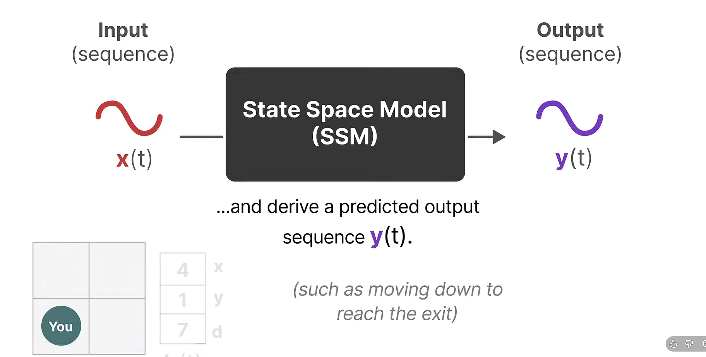{width="3.7281878827646544in"
height="1.8884634733158354in"}

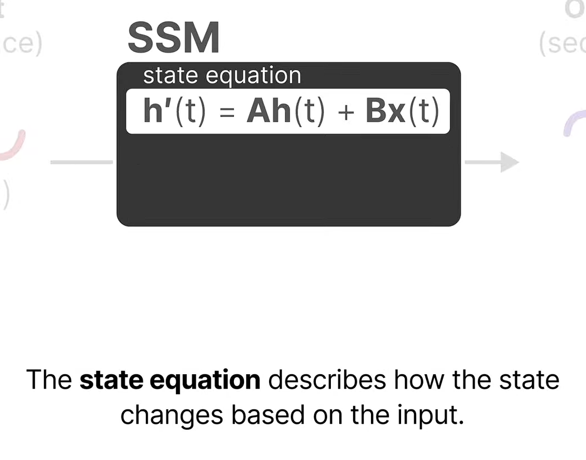{width="2.4044805336832895in"
height="1.88794072615923in"}{width="2.37367125984252in"
height="2.03915791776028in"}

두 개의 식이 핵심.

1.  State equation

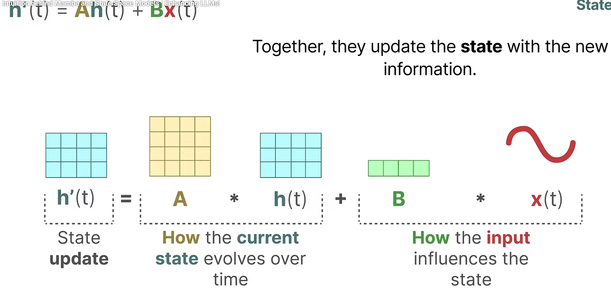{width="6.039711286089239in"
height="3.044613954505687in"}

{width="6.268055555555556in"
height="1.3395833333333333in"}

{width="6.268055555555556in"
height="3.276388888888889in"}

{width="6.268055555555556in"
height="0.7048611111111112in"}

2.  Output equation

> 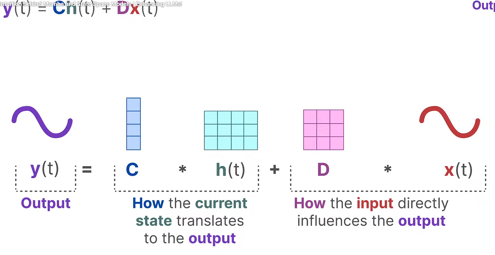{width="5.839911417322835in"
> height="3.0163593613298336in"}
>
> {width="6.127471566054243in"
> height="3.597328302712161in"}

h'(t)는 어떻게 쓰이는가?

{width="6.268055555555556in"
height="3.9159722222222224in"}

{width="6.268055555555556in"
height="3.10625in"}

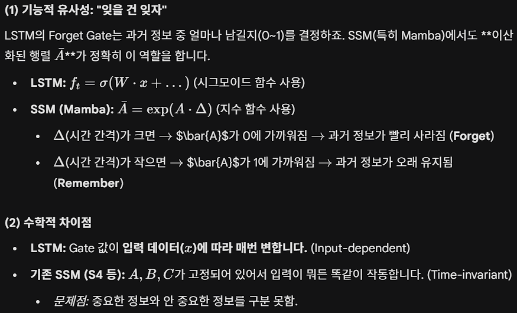{width="6.268055555555556in"
height="3.796527777777778in"}

{width="6.268055555555556in"
height="2.307638888888889in"}

여기를 보면 mamba가 기존 RNN과는 다르게 SSM 기반 **linear equation**을
사용해서 기존의 RNN과 다르게 병렬계산이 가능하게 한 것 같음.

\<초간단 흐름도\>

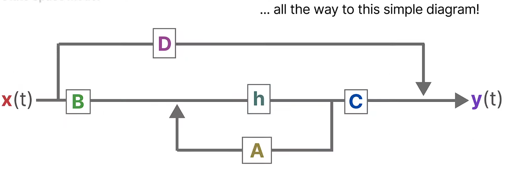{width="6.268055555555556in"
height="2.0875in"}

{width="2.4637554680664917in"
height="0.5423753280839895in"}

{width="6.268055555555556in"
height="2.9715277777777778in"}

{width="3.8620330271216097in"
height="1.7076640419947506in"}

{width="6.268055555555556in"
height="2.828472222222222in"}

{width="6.268055555555556in"
height="4.0375in"}

{width="6.268055555555556in"
height="1.023611111111111in"}

{width="6.268055555555556in"
height="2.7743055555555554in"}

{width="6.268055555555556in"
height="2.660416666666667in"}

Discrete input(e.g. text)을 연속으로 바꾸어서 SSM에 넣고 연속된 ouput을
다시 discrete하게 바꾸어줌.

{width="2.386590113735783in"
height="2.107574365704287in"}

행렬지수함수가 대체 무엇인가? (e)를 행렬만큼 거듭제곱한다는 게 무슨
소리인가.

{width="6.268055555555556in"
height="3.6791666666666667in"}

{width="6.268055555555556in"
height="0.5520833333333334in"}

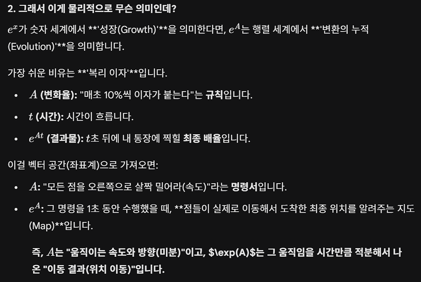{width="6.268055555555556in"
height="4.2027777777777775in"}

{width="6.268055555555556in"
height="3.9409722222222223in"}

Bar B는 왜 이렇게 수식이 복잡할까.

{width="6.268055555555556in"
height="1.8715277777777777in"}

{width="6.268055555555556in"
height="4.223611111111111in"}

{width="6.268055555555556in"
height="3.359722222222222in"}

{width="6.268055555555556in"
height="0.5805555555555556in"}

**중간정리**

{width="1.8943372703412074in"
height="1.1607852143482065in"}

h'(t)는 현재 상태의 변화량.

현재 상태인 h와 input x의 linear combination에 의해 결정된다.

ZOH 방식에 따라 이산화 점화식으로 계산을 해준다.

{width="2.2640923009623797in"
height="1.1359372265966754in"}{width="2.732234251968504in"
height="0.8542475940507437in"}

자연상수에 대해 행렬거듭제곱을 시킨 A bar를 구하는데 이것은 물리적으로
변화율 A가 주어졌을 때 실제 변화량을 의미한다. (정확히 왜 그런지는
모르겠다)

(\*행렬거듭제곱의 의미는 위에 찾아둠. 테일러 무한 급수 사용해서 행렬을
지수의 개념으로 사용한 듯)

B bar는 식이 복잡한데, 시스템의 특성인 A와 input의 상호작용을 고려한
계수이다. 변화량($e^{ax}$)를 적분해서 계수에 곱해줌.

{width="3.300632108486439in"
height="0.8560586176727909in"}

즉 A라는 시스템의 변화를 고려한 계수 B bar가 input x를 상태 업데이트에
얼마나 반영할 것인지 결정하는 것.

{width="6.268055555555556in"
height="2.9923611111111112in"}

{width="6.268055555555556in"
height="3.015277777777778in"}

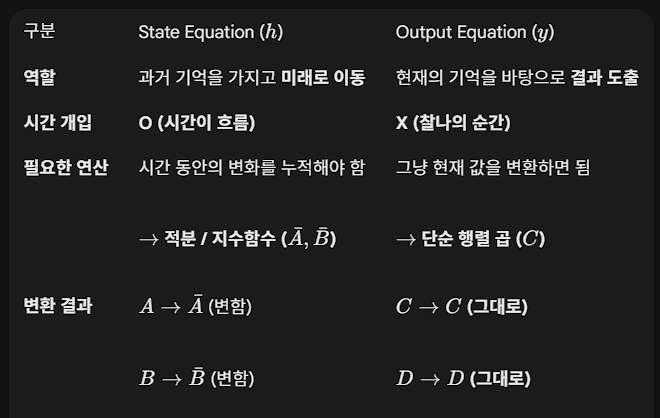{width="4.089840332458443in"
height="2.5900207786526686in"}

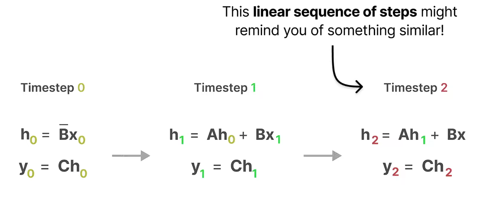{width="4.776278433945757in"
height="1.5582775590551181in"}

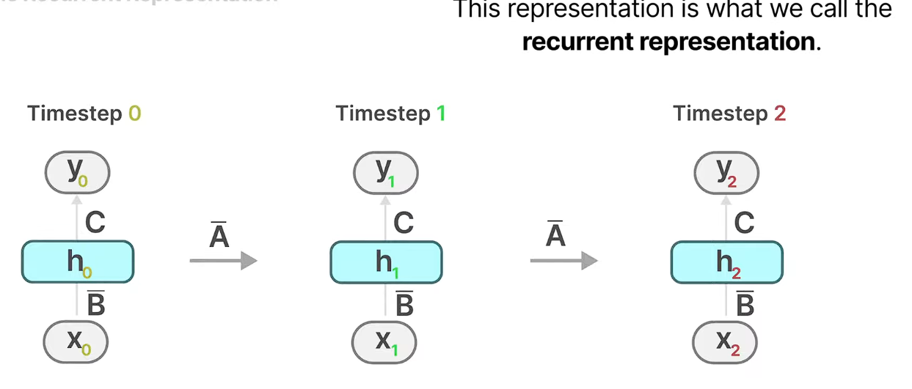{width="4.459062773403325in"
height="1.904957349081365in"}{width="1.6634011373578304in"
height="1.9553226159230097in"}

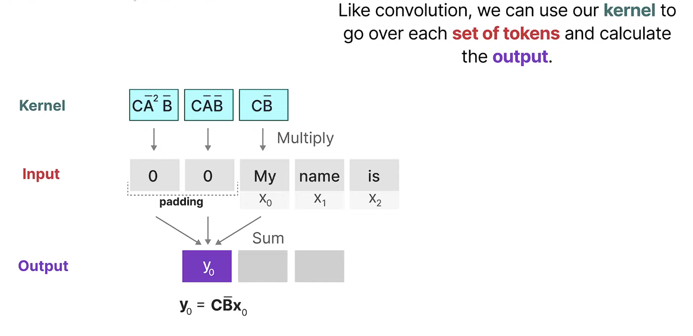{width="4.9287970253718285in"
height="2.3988713910761157in"}

{width="6.268055555555556in"
height="4.204861111111111in"}

{width="6.268055555555556in"
height="1.2958333333333334in"}

합성곱을 한 번에 할 때는 푸리에 변환을 이용.

{width="6.268055555555556in"
height="3.134027777777778in"}

{width="6.268055555555556in"
height="3.404861111111111in"}

\<S4\>

{width="6.268055555555556in"
height="2.354861111111111in"}

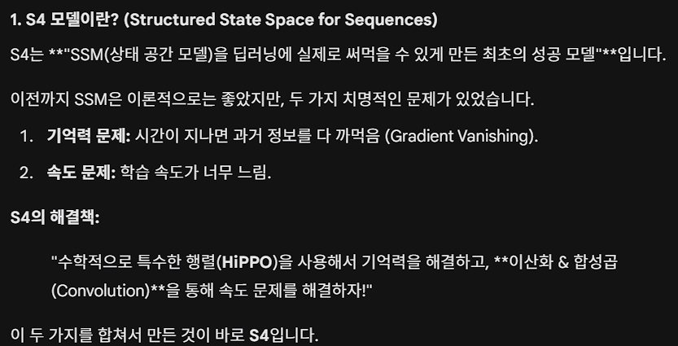{width="6.268055555555556in"
height="3.1979166666666665in"}

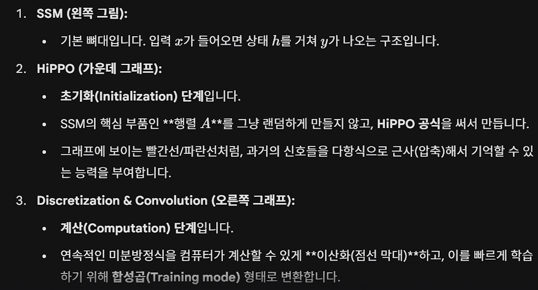{width="5.4720931758530185in"
height="2.954300087489064in"}

{width="6.268055555555556in"
height="0.5243055555555556in"}

S4는 SSM을 딥러닝으로 구현에 성공한 첫 모델. HiPPO로 vanishing gradient
문제를 해결하고, 합성곱으로 학습속도를 빠르게 했다. (SSM 식의
linearity랑 A, B, C가 고정되어 있기 때문에 합성곱이 가능한 것이다.)

{width="6.268055555555556in"
height="2.3006944444444444in"}

여기서 발전한 것이 mamba

{width="6.268055555555556in"
height="0.5159722222222223in"}

Q. 왜 SSM식이 linear 한가?

{width="6.268055555555556in"
height="1.8298611111111112in"}

SSM(S4)의 문제점

{width="6.268055555555556in"
height="1.0965277777777778in"}

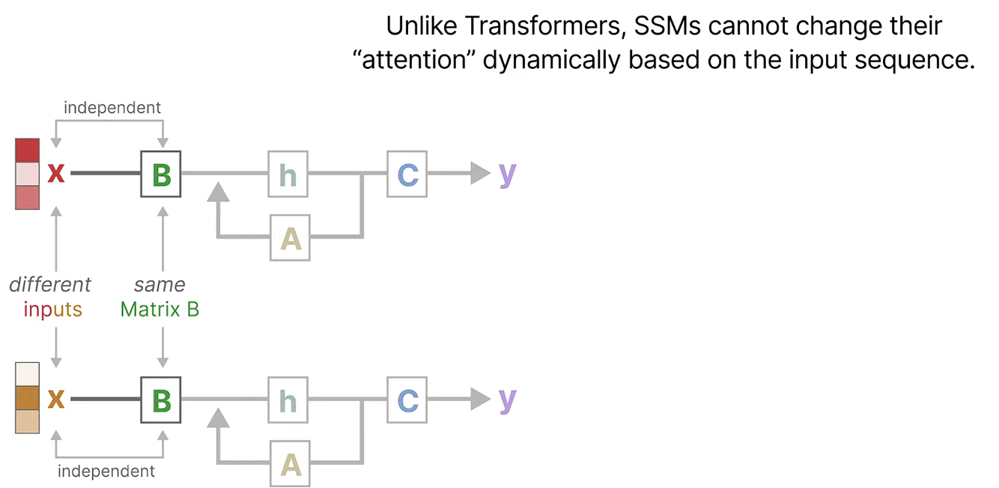{width="6.268055555555556in"
height="3.0590277777777777in"}

맘바에서 B는 고정되어 있지 않음. C랑 step size도 동일하게 유동적(입력
의존적 파라미터)

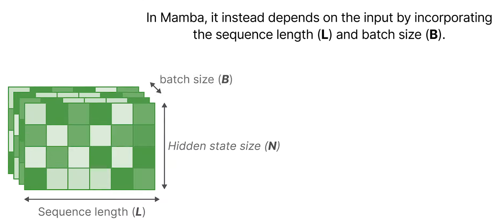{width="6.268055555555556in"
height="2.80625in"}

{width="6.268055555555556in"
height="2.667361111111111in"}

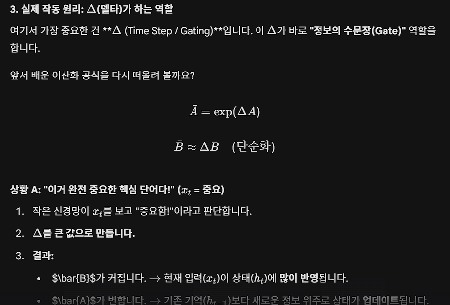{width="6.268055555555556in"
height="4.243055555555555in"}

{width="5.738182414698163in"
height="2.2263582677165354in"}

맘바는 RNN과 Transformer 중간 어디쯤에 있다.

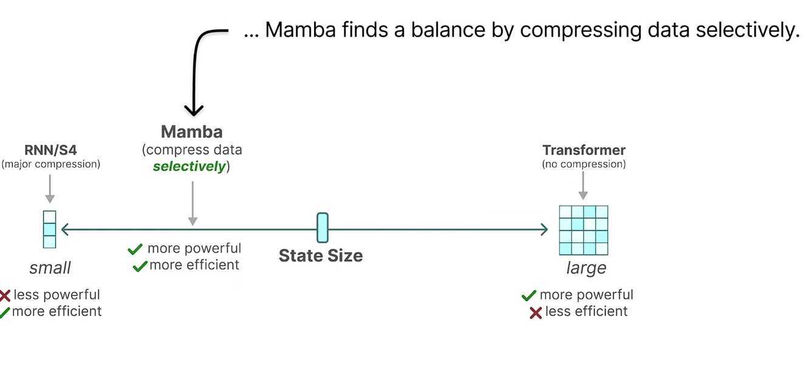{width="6.268055555555556in"
height="2.9347222222222222in"}

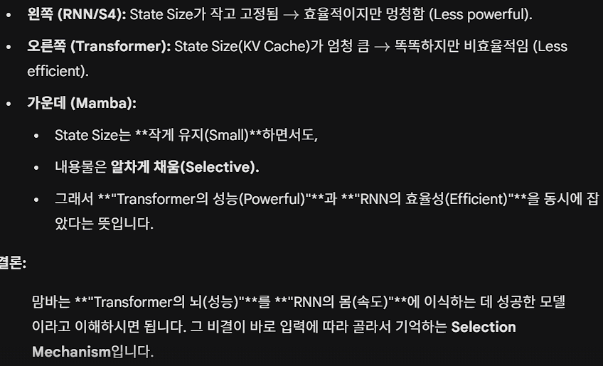{width="6.268055555555556in"
height="3.8069444444444445in"}

{width="5.110567585301837in"
height="2.114209317585302in"}

쉽게 생각하면 mamba의 '선별적 압축'이라는 특징은 기존의 RNN과 다르게
계수들이 input 값에 따라 유동적으로 바뀐다는 것이고, 이것이 RNN의
메모리/계산량 효율적인 특징을 가지면서도 attention을 이용하는
transformer처럼 성능이 강력한 것이다. 라고 이해하면 되려나.

(SSM을 RNN처럼 이해할 수 있으니까.)

{width="6.268055555555556in"
height="3.1791666666666667in"}

**Q. SSM이 어디서 나온 개념인가? 왜 맘바가 굳이 이 개념을 구현한
모델인가?**

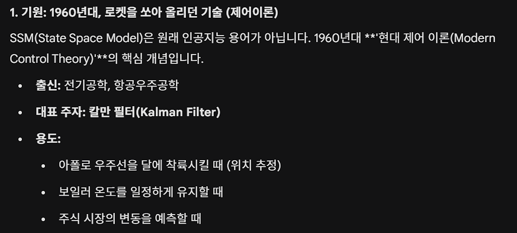{width="6.268055555555556in"
height="2.821527777777778in"}

{width="6.268055555555556in"
height="1.1534722222222222in"}

{width="6.268055555555556in"
height="3.2319444444444443in"}

{width="6.268055555555556in"
height="4.340972222222222in"}

{width="6.268055555555556in"
height="1.5083333333333333in"}

{width="6.268055555555556in"
height="3.134027777777778in"}

**중간정리**

Mamba는 RNN의 특성 (계산/메모리 효율성)을 유지하면서 transformer처럼
유의미한 성능을 가지는 모델이다.

SSM(제어이론), 입력을 받아 시스템의 상태를 예측하는 것 -\> RNN처럼 구현
-\> HiPPO를 사용해 이전 상태 기억 보존 -\> convolution 사용해 학습과정
병렬처리, 추론은 기존 RNN처럼 -\> 파라미터가 고정되어 있기 때문에 맥락을
파악하는 능력이 없음. -\> 파라미터가 변하는 '선별적 압축' (mamba 특징1)
-\> long input sequence에 대해 성능은 좋으나 파라미터 변동으로
convolution 병렬처리 불가 -\> parallel scan (mamba 특징2) -\> 학습
병렬처리 가능.

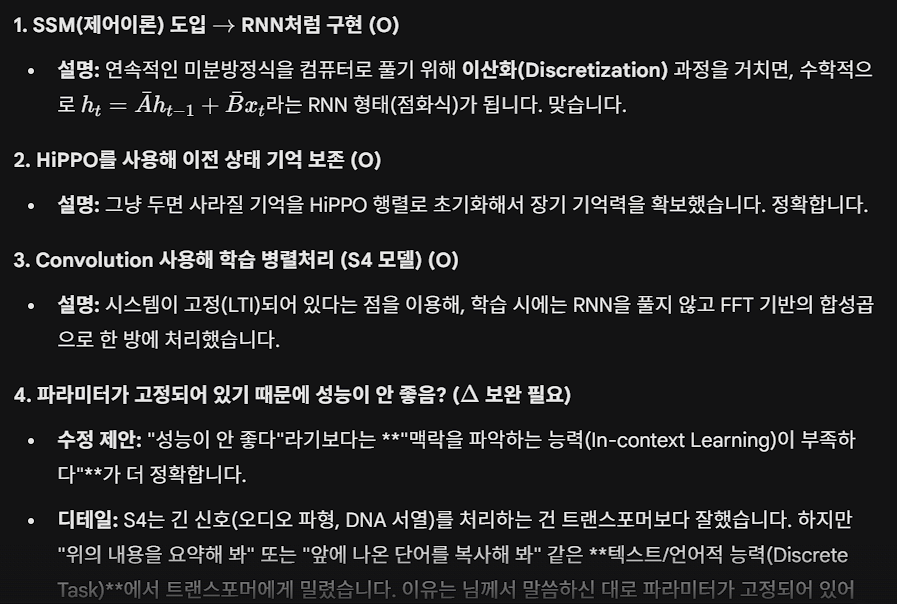{width="6.268055555555556in"
height="4.220833333333333in"}

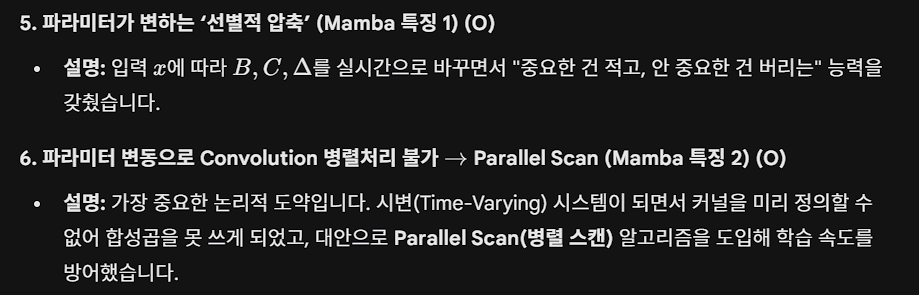{width="6.268055555555556in"
height="2.0118055555555556in"}

{width="6.268055555555556in"
height="3.127083333333333in"}

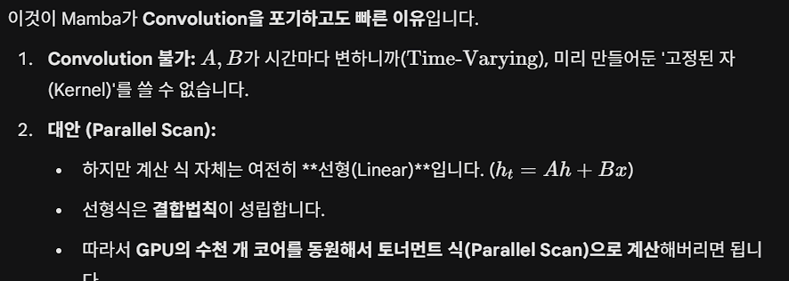{width="6.268055555555556in"
height="2.2354166666666666in"}

{width="6.268055555555556in"
height="1.9416666666666667in"}

Parallel scan(그중에서도 Blelloch Scan)

대충 식이 linear하니까 짝지어서 계산하는 것 같은데 정확한 원리를
모르겠다...

{width="6.268055555555556in"
height="3.6381944444444443in"}

{width="6.268055555555556in"
height="1.23125in"}

최종장... 그 이후

{width="6.268055555555556in"
height="1.4236111111111112in"}

Mamba + Transformer

{width="6.268055555555556in"
height="1.3625in"}
